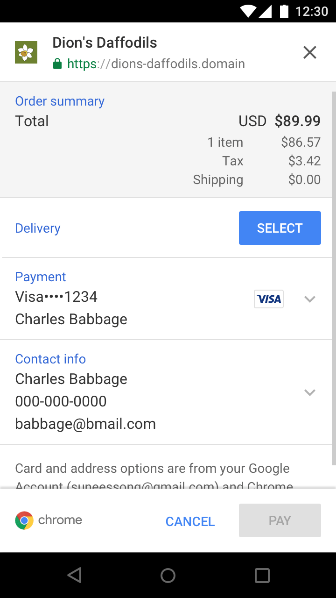

In the Chrome UI, the Payment Request API has two states: the 'receipt' view and the edit view. The 'receipt' view (shown at left, below) partially obscuring the merchant's site. This allows the user to take a quick glance at their payment details. Then there is the edit view (shown at right, below), which expands full screen and allows the user to edit each section. Once the user taps or clicks a call to action from the 'receipt' view they will enter the edit mode and will be forced to continue there.

  <figure>
    
  </figure>

  <figure>
    
  </figure>

## Basic checkout flow
